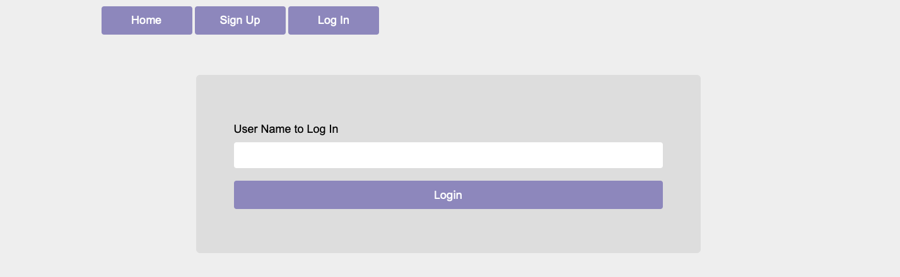
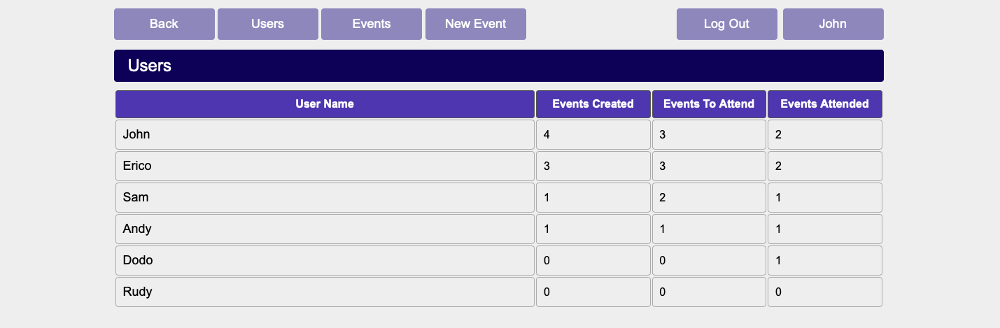
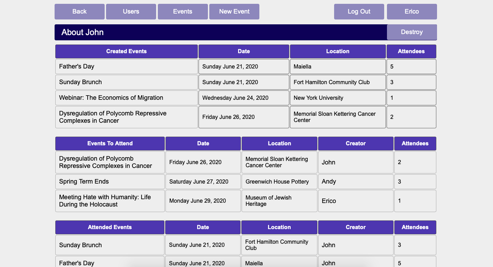
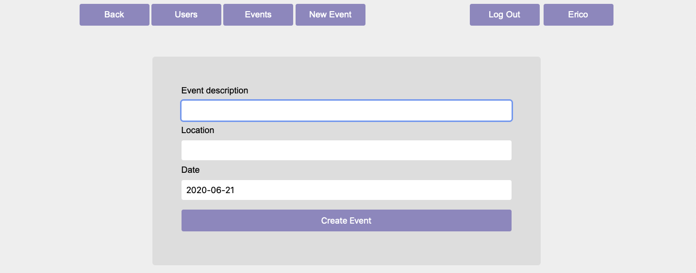
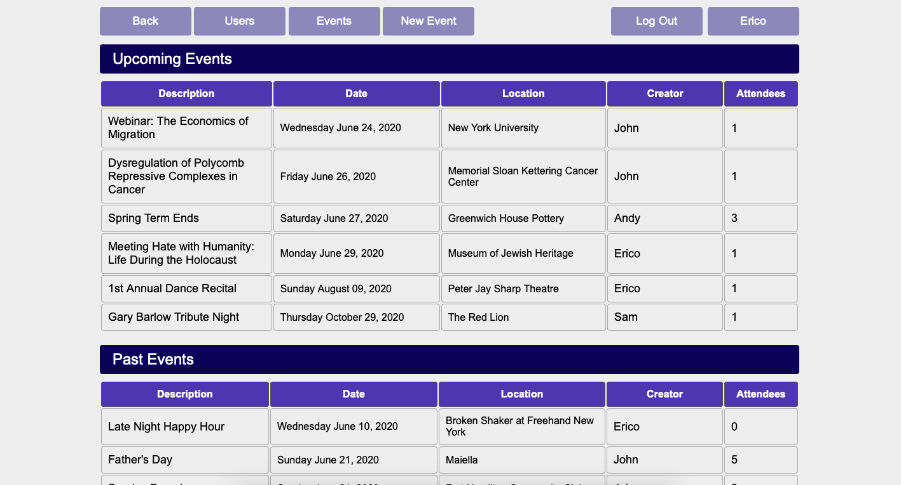
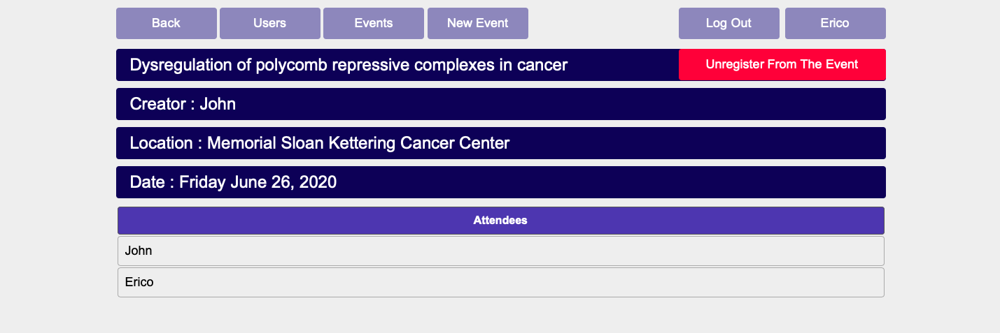
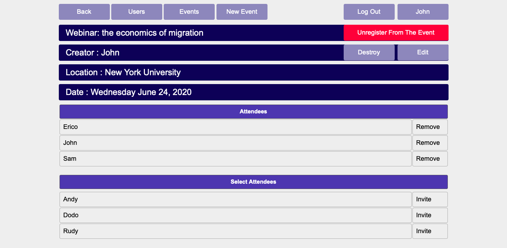

# Private Events

<!--
*** Thanks for checking out this README Template. If you have a suggestion that would
*** make this better, please fork the repo and create a pull request or simply open
*** an issue with the tag "enhancement".
*** Thanks again! Now go create something AMAZING! :D
-->

<!-- PROJECT SHIELDS -->
<!--
*** I'm using markdown "reference style" links for readability.
*** Reference links are enclosed in brackets [ ] instead of parentheses ( ).
*** See the bottom of this document for the declaration of the reference variables
*** for contributors-url, forks-url, etc. This is an optional, concise syntax you may use.
*** https://www.markdownguide.org/basic-syntax/#reference-style-links
-->

[![Contributors][contributors-shield]][contributors-url]
[![Forks][forks-shield]][forks-url]
[![Stargazers][stars-shield]][stars-url]
[![Issues][issues-shield]][issues-url]

<!-- PROJECT LOGO -->
<br />
<p align="center">
  <a href="https://github.com/ioanniskousis/private-events">
    
  </a>
  
  <h3 align="center">Private Events Application</h3>
  
  <p align="center">
    This project is part of the Microverse curriculum in Ruby On Rails course!
    <br />
    <a href="https://github.com/ioanniskousis/private-events"><strong>Explore the docs »</strong></a>
    <br />
    <br />
    <a href="https://github.com/ioanniskousis/private-events/issues">Report Bug</a>
    <a href="https://github.com/ioanniskousis/private-events/issues">Request Feature</a>
  </p>
</p>

Private Events allows users to create events and invite other users to their events.

<hr />
<!-- TABLE OF CONTENTS -->

## Table of Contents
- [Application Screen Shots](#application-screen-shots)
- [About the Project](#about-the-project)
- [Future Features](#future-features)
- [Application Instructions](#application-instructions)
- [System Requierments](#system-requierments)
- [Dependencies](#dependencies)
- [Configuration](#configuration)
- [Development](#development)
- [Testing](#testing)
- [Built With](#built-with)
- [Contributors](#contributors)
- [Acknowledgements](#acknowledgements)

<hr />

## Application Screen Shots

## Sign Up


<hr />

## Log In


<hr />

## Users List


<hr />

## User show


<hr />

## New event


<hr />

## Events List


<hr />

## Event show of non-creator


<hr />

## Event show of creator



<hr />

<!-- ABOUT THE PROJECT -->

## About The Project

The project creates a database which holds 3 tables:

    - Users : Is the table containing the users' data
      - Fields :
        - string: name
        - datetime: created_at
        - datetime: update_at

    - Events : is the table containing the events' data
      - Fields:
        - text: description
        - string: location
        - datetime: event_date
        - integer: user_id
        - datetime: created_at
        - datetime: update_at

      - user_id is the id of the creator user

    - Events_Users : is the Join Table that contains the users' events attendance
      - Fields :
        - integer: use_id
        - integer: event_id

Constraints for tables are as follows:

- Users Table

  - name: required

- Events Table
  - description: required
  - location: required
  - event_date : required

We added our styling choices editing the application.css file

<hr/>

## Future Features
  ### Following version may include
  - Creators of the each event may add images and other media, so users may have a taste of what to expect before the event 
  - Attendees may add comments and media on each event, so they can feed-back their experience
  
<hr/>

<!-- ABOUT THE PROJECT -->

## Application Instructions

- New users must sign up and give a name, otherwise they can only access the events index
- Using just their name they can log in
- A logged in user can create events and invite other users to attend those events
- Invitations or removals can be applied from the event's show page by clicking
  - 'Invite' in the 'Select Attendees' list, or
  - remove invitation by clicking 'Remove' at the 'Attendees' list
- An event requires a description, a location and an event date
- Users also can register to attend other's users' events
- Users can edit or delete their own created events and their own account

<hr/>

## System Requirerments

- Ruby
- Rails
- Yarn
- RSpec

## Dependencies

- rspec-rails gem
- capybara gem
- selenium-webdriver gem
- chromedriver-helper gem

## Configuration

- first, clone the project
  Run

```
  git clone https://github.com/ioanniskousis/private-events.git
```

- Install the necessary dependancies
  Run

```
  bundle install
  rails generate rspec:install
  yarn install
```

<hr/>

## Development

- Clone the project

```
  https://github.com/ioanniskousis/private-events.git
```

<hr/>

## Testing

- Tests have been included using RSpec for controllers, views and models
- Location /spec/
- 6 test files
  - main_menu_spec.rb  
    Tests the functionality of the application's menu bar buttons
  - controllers/events_controller_spec.rb  
    Tests the actions of the events controller
  - controllers/session_controller_spec.rb  
    Tests the actions of loging in ang logging out
  - controllers/user_controller_spec.rb  
    Tests the actions of users controller
  - models/event_spec.rb  
    Tests the functionallity of event model
  - models/user_spec.rb  
    Tests the functionality of user model

### Controller test files implement the views tests as well.

<hr/>

## Built With

This project was built using these technologies.

- Ruby version 2.6
- Ruby On Rails version 6.0
- rspec
- capybara

<hr/>

<!-- CONTACT -->

## Contributors

:bust_in_silhouette: **Author_1**

## Ioannis Kousis

- Github: [@ioanniskousis](https://github.com/ioanniskousis)
- Twitter: [@ioanniskousis](https://twitter.com/ioanniskousis)
- Linkedin: [Ioannis Kousis](https://www.linkedin.com/in/jgkousis)
- E-mail: jgkousis@gmail.com

:bust_in_silhouette: **Author_2**

## Eric Mbouwe

- Github: [@ericmbouwe](https://github.com/ericmbouwe)
- Twitter: [@ericmbouwe](https://twitter.com/ericmbouwe)
- Linkedin: [Eric Mbouwe](https://www.linkedin.com/in/ericmbouwe/)
- E-mail: ericmbouwe@gmail.com

<hr/>
<!-- ACKNOWLEDGEMENTS -->

## Acknowledgements

- [Microverse](https://www.microverse.org/)
- [The Odin Project](https://www.theodinproject.com/)
- [Ruby Documentation](https://www.ruby-lang.org/en/documentation/)

<!-- MARKDOWN LINKS & IMAGES -->
<!-- https://www.markdownguide.org/basic-syntax/#reference-style-links -->

[contributors-shield]: https://img.shields.io/github/contributors/ioanniskousis/private-events.svg?style=flat-square
[contributors-url]: https://github.com/ioanniskousis/private-events/graphs/contributors
[forks-shield]: https://img.shields.io/github/forks/ioanniskousis/private-events.svg?style=flat-square
[forks-url]: https://github.com/ioanniskousis/private-events/network/members
[stars-shield]: https://img.shields.io/github/stars/ioanniskousis/private-events.svg?style=flat-square
[stars-url]: https://github.com/ioanniskousis/private-events/stargazers
[issues-shield]: https://img.shields.io/github/issues/ioanniskousis/private-events.svg?style=flat-square
[issues-url]: https://github.com/ioanniskousis/private-events/issues
